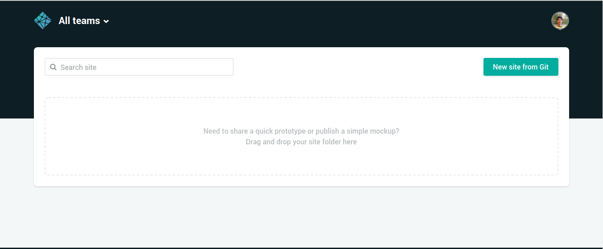
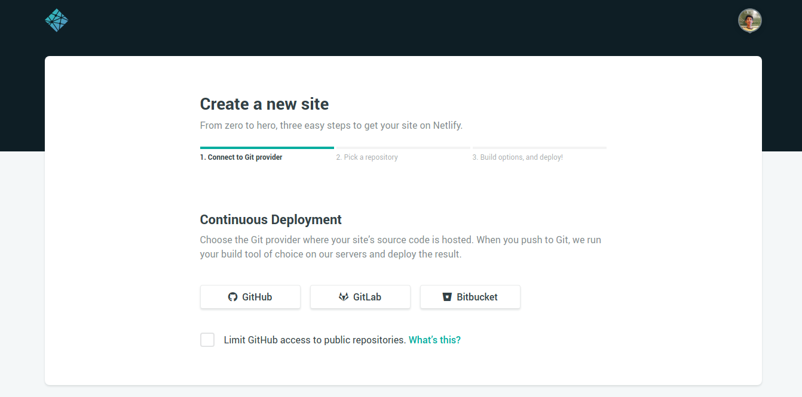
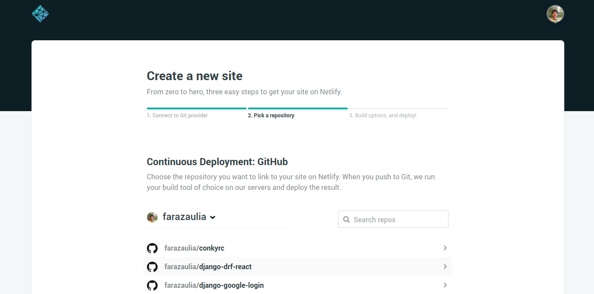
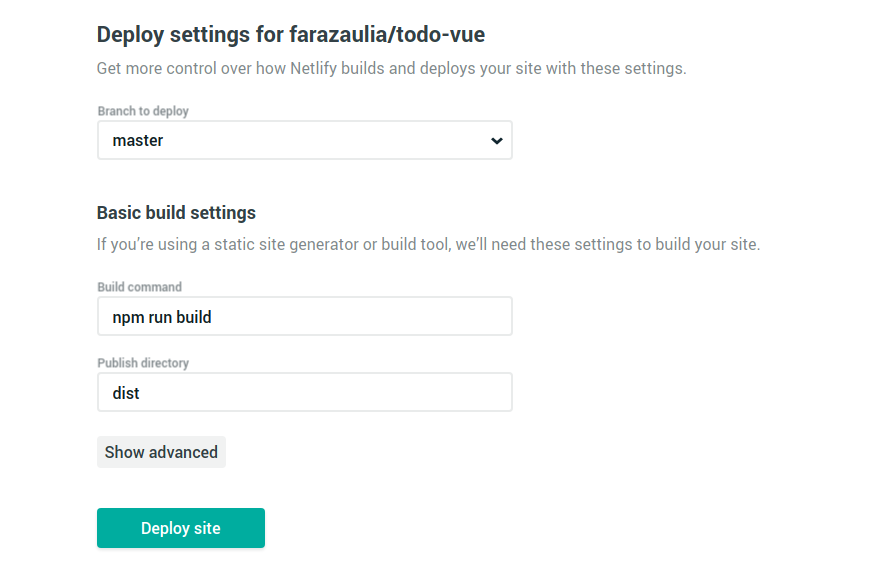

](./asset-1.jpeg)

[Netlify](https://www.netlify.com/) adalah layanan SaaS yang memberikan kemudahan untuk kita mem-publish web statis.

### Prerequisites

-   **Website — **Hal pertama yang dibutuhkan adalah sebuah halaman website. Pada kesempatan ini saya akan mencontohkannya dengan website yang telah saya buat menggunakan Vue JS.
-   **Git Repository — **Hal selanjutnya yang dibutuhkan adalah source code halaman website Anda harus disimpan disebuah repository git. Saya menggunakan [Github](https://github.com/), namun Anda juga dapat menggunakan layanan lainnya seperti [Bitbucket](https://bitbucket.org/) atau [Gitlab](https://gitlab.com).

### Deploying

Buat akun atau login ke Netlify di [https://app.netlify.com/](https://app.netlify.com/)

Setelah login dan masuk ke halaman dashboard, tekan tombol **New site from Git**

Kemudian pilih provider git yang Anda inginkan dan beri izin akses pada aplikasi, disini saya memilih github.

Setelah terhubung dengan provider git Anda, maka repository yang ada di akun Anda akan ditampilkan. Kemudian pilih project repository yang ingin di deploy ke Netlify.

Saya memilih project **todo-vue**. Isi form bagaimana website Anda akan di build.

Karena saya menggunakan Vue JS maka perintah untuk **build command** adalah `npm run build` dan untuk **publish directory** adalah folder `dist` (contoh lainnya dilihat di: [https://www.netlify.com/docs/continuous-deployment/#common-configuration-directives](https://www.netlify.com/docs/continuous-deployment/#common-configuration-directives)). Terakhir tekan **Deploy site** dan tunggu beberapa saat hingga website Anda selesai di build.

### Selamat, Website Anda telah LIVE!

Untuk melakukan deploy selanjutnya, Anda hanya perlu melakukan push ke repository project git Anda dan Netlify akan secara otomatis memperbarui website Anda.

**Referensi**

[**Docs | Netlify**  
_Netlify builds, deploys, and hosts your front end. Learn how to get started, see examples, and view documentation for…_www.netlify.com](https://www.netlify.com/docs/ "https://www.netlify.com/docs/")

[**farazaulia/todo-vue**  
_Download source code todo-vue app_github.com](https://github.com/farazaulia/todo-vue "https://github.com/farazaulia/todo-vue")
