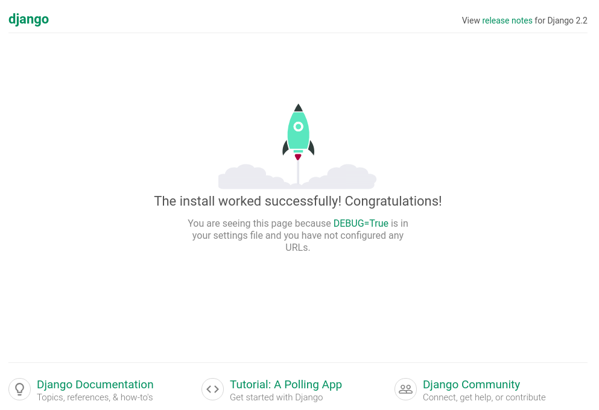

### Introduction

Django adalah sebuah open source Python framework yang digunakan untuk membuat web site dinamis. Django dikembangkan oleh [Django Sofware Foundation](https://www.djangoproject.com/foundation/). Saat pertama kali melakukan pengembangan aplikasi menggunakan Django, saya kesulitan untuk melakukan deploy aplikasi untuk production environment. Setelah beberapa kali melakukan pencarian dan percobaan melalui internet, akhirnya saya berhasil menemukan caranya.

Dalam tulisan ini saya akan berbagi cara untuk melakukan konfigurasi aplikasi Django 2.2 dengan Python 3, gunicorn, supervisor dan nginx di Fedora 29.

### Prerequisites

Install beberapa package  yang dibutuhkan pada server. Disini saya akan menggunakan `dnf` sebagai package manager dari Fedora dan `pip` untuk meng-install beberapa package tambahan.

Buka terminal kemudian install package:

```
sudo dnf install python3 python3-pip supervisor nginx
```

### Buat Python Virtual Environment  untuk Project Django

Sebelum memulai project, kita harus menyiapkan virtual environment untuk mengisolasi project python agar tidak mengganggu modul-modul python yang ada di project lainnya. Untuk lebih jelasnya silahkan baca [https://pipenv.readthedocs.io/en/latest/](https://pipenv.readthedocs.io/en/latest/)

Untuk melakukannya, install `pipenv` menggunakan `pip`:

```
pip3 install pipenv
```

Setelah terinstall, buat sebuah folder untuk project django kita dan masuk kedalam folder tersebut.

```
mkdir ~/projectku
cd ~/projectku
```

Di dalam folder tersebut jalankan perintah untuk mengaktifkan virtual environment.

```
pipenv --three
```

Flag `--three` berfungsi untuk membuat virtual environment menggunakan python versi 3. Setelah menjalankan perintah di atas, akan muncul sebuah file bernama `Pipfile` yang menandakan bahwa virtual environment telah berhasil dibuat.

Sebelum kita menginstall modul Python lainnya, aktifkan terlebih dahulu virtual environment agar modul yang kita install nantinya hanya akan digunakan di folder project tersebut. Inilah salah satu fungsi virtual environment yang sebelumnya telah dijelaskan. Untuk mengaktifkannya, jalankan perintah:

```
pipenv shell
```

Jika sudah aktif, terminal prompt Anda akan berubah yang mengindikasikan virtual environment mana yang sedang aktif seperti:

```
(projectku) user@host ~/projectku $
```

Selanjutnya kita akan menginstall Django dan gunicorn di dalam virtual environment yang aktif

```
pipenv install django gunicorn
```

Untuk melihat package yang sudah terinstall, jalankan perintah `pipenv graph` hasilnya akan tampil seperti:

```
Django==2.2
  - pytz [required: Any, installed: 2018.9]
  - sqlparse [required: Any, installed: 0.3.0]
gunicorn==19.9.0
```

### Buat Project Django

Masih di dalam folder `projectku` serta virtual environment dalam kondisi aktif, buat project django baru dengan perintah:

```
django-admin.py startproject projectku .
```

Setelah project dibuat, ubah `ALLOWED_HOSTS = []` menjadi `ALLOWED_HOSTS = ['*']` yang ada di dalam file `projectku/settings.py`

### Tes Project Django & Gunicorn

Setelah project terbuat, kita akan melakukan tes apakah aplikasi dapat berjalan.

```
./manage.py runserver 0.0.0.0:8000
```

Kemudian buka `http://localhost:8000` di browser.



Jika tampil seperti gambar di atas, maka project Django telah berhasil dibuat. Selanjutnya kita lakukan tes menjalankan aplikasi menggunakan gunicorn.

```
cd ~/projectku
gunicorn projectku.wsgi:application --bind 0.0.0.0:8000
```

Buka kembali `[http://localhost:8000](http://localhost:8000)` di browser. Jika menampilkan hal yang sama seperti sebelumnya berarti gunicorn berhasil dijalankan.

### Membuat File Start Gunicorn

Sekarang kita akan membuat script untuk menjalankan perintah gunicorn

```
mkdir deployment && cd deployment
vi gunicorn-start.sh
```

Kemudian masukkan script berikut:

<Embed src="https://gist.github.com/farazaulia/5834e43cfac8a656af01f0614f36afdb.js" aspectRatio={0.357} />

Ganti `project_name` menjadi `projectku`,`path_to_project` menjadi `~/projectku` dan `user` menjadi nama pengguna Anda.

Buat file `gunicorn-start.sh` menjadi executable

```
chmod +x gunicorn-start.sh
```

### Buat File Konfigurasi Supervisor

Cek supervisor status:

```
sudo systemctl status supervisord.service
```

Jika supervisor belum activa, maka jalankan supervisor

```
sudo systemctl start supervisord.service
```

Kemudian buat file konfigurasi supervisor untuk menjalankan script `gunicorn-start.sh`

```
mkdir ~/projectku/logs
sudo vi /etc/supervisord.d/projectku.ini
```

Tambahkan srcipt berikut:

<Embed src="https://gist.github.com/farazaulia/0f53c844194c643fb33d99e0a428ab06.js" aspectRatio={0.357} />

Ganti `project_name` dengan `projectku`, `path_to_project` dengan `/home/{nama_pengguna}/projectku/deployment` dan `user` dengan nama pengguna Anda di server.

Jalankan perintah `reread` dan `update` supervisor agar file konfigurasi tadi terbaca.

```
sudo supervisorctl reread
sudo supervisorctl update
```

Kemudian jalankan `sudo supervisorctl start projectku`

### Membuat Konfigurasi Nginx

Setelah semuanya berjalan lancar, maka hal terakhir yang harus dilakukan adalah membuat file konfigurasi nginx

```
sudo vi /etc/nginx/sites-available/projectku
```

Tambahkan script berikut kedalamnnya

```
server {
    listen 80;
    server_name projectku.demo;

    client_max_body_size 4G;

    access_log /home/{nama_pengguna}/projectku/logs/nginx-access.log;
    error_log /home/{nama_pengguna}/projectku/logs/nginx-error.log;

location / {
        proxy_pass http://127.0.0.1:8000;
        proxy_set_header X-Forwarded-For $proxy_add_x_forwarded_for;
        proxy_set_header Host $host;
    }
}
```

Kemudian buat symbolic link

```
sudo ln -s /etc/nginx/sites-available/projectku /etc/nginx/sites-enabled/
```

Tambahkan domain name ke `/etc/hosts`

```
127.0.0.1   projectku.demo
```

Test nginx konfigurasi

```
sudo nginx -t
```

Jika tidak ada error yang terjadi, restart nginx

```
sudo nginx -s reload
```

Sekarang Anda dapat mengakses website dari browser menggunakan ip ataupun nama domain `projectku.demo`
