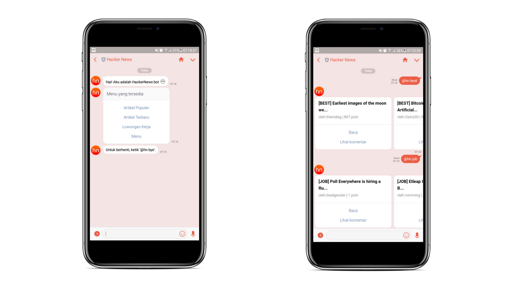

 ([2012](https://dribbble.com/shots/797096-Hacker-News-logo-concept))](./asset-1.png)

Pada artikel sebelumnya kita telah berhasil untuk membuat bot sederhana dan men-deploy ke Heroku. Hari ini, kita akan mencoba untuk menggunakan [HackerNews API](https://github.com/HackerNews/API) di bot kita. Tapi sebelum kita lanjut, pastikan dulu Anda telah membaca artikel dibawah untuk mengetahui dasar-dasarnya.

[**Membuat LINE Bot dengan Python**  
_Tutorial lengkap memanfaatkan LINE Messaging API dan Python Flask untuk membuat chatbot_medium.com](https://medium.com/@farazaulia/membuat-line-bot-dengan-python-33b85878ba40 "https://medium.com/@farazaulia/membuat-line-bot-dengan-python-33b85878ba40")[](https://medium.com/@farazaulia/membuat-line-bot-dengan-python-33b85878ba40)

---

### Persiapan

Download atau clone repository line-starter-bot dibawah ini.

[**farazaulia/line-starter-bot**  
_line-starter-bot - Starter kit to get started with a LINE chatbot_github.com](https://github.com/farazaulia/line-starter-bot "https://github.com/farazaulia/line-starter-bot")[](https://github.com/farazaulia/line-starter-bot)

Buka command line dan masuk ke direktori proyek.

```
cd line-starter-bot
```

Kemudian install dependencies yang diperlukan dan aktifkan virtual environment.

```
pipenv install
pipenv shell
```

Buka folder project di text editor dan buat file baru di root folder dengan nama `.env` kemudian tambahkan CHANNEL\_ACCESS\_TOKEN & CHANNEL\_SECRET ke dalamnya. Kedua data tersebut bisa di dapatkan dari developer console LINE [disini](https://developers.line.me/console/).

```
LINE_CHANNEL_SECRET="XXXXXX"
LINE_CHANNEL_ACCESS_TOKEN="XXXXXX"
```

### Mulai membuat bot

Import beberapa module tambahan dari `linebot.models` agar kita dapat menggunakan jenis pesan lebih banyak.

```
from linebot.models import (
    MessageEvent, TextSendMessage, TextMessage,
    CarouselColumn, URITemplateAction, TemplateSendMessage,
    CarouselTemplate, FollowEvent, MessageTemplateAction,
    ButtonsTemplate, JoinEvent, LeaveEvent
)
```

Pertama kita akan membuat fungsi `greeting` di bawah fungsi `callback` agar bot memberi salam pembuka saat ditambahkan sebagai teman.

```
def prepareTitle(keyword, text):
    result = text[:30] + "..." if len(text) > 40 else text
    result = "[{}] {}".format(keyword.upper(), result)
    return result
```

Buat fungsi baru dengan nama `getStories` setelah fungsi `greeting`. Fungsi ini untuk mengambil stories dari api HackerNews

```
def getStories(event, keyword):
    stories = []
    result = []


    data = requests.get(
        'https://hacker-news.firebaseio.com/v0/{}stories.json?print=pretty'.format(keyword))


    for num in data.json()[:5]:
        stories.append(requests.get(
            'https://hacker-news.firebaseio.com/v0/item/{}.json?print=pretty'.format(num)).json())


    for value in stories:
        title = prepareTitle(keyword, value['title'])
        desc = "oleh {} | {} poin".format(
            value['by'], str(value['score']))
        comment_url = 'https://news.ycombinator.com/item?id={}'.format(
            str(value['id']))


        try:
            url = value['url']
        except KeyError:
            url = comment_url


        column = CarouselColumn(
            title=title,
            text=desc,
            actions=[
                URITemplateAction(
                    label='Baca',
                    uri=url
                ),
                URITemplateAction(
                    label='Lihat komentar',
                    uri=comment_url
                ),
            ]
        )
        result.append(column)


    carousel = TemplateSendMessage(
        alt_text="5 hasil teratas",
        template=CarouselTemplate(
            columns=result
        )
    )


    result_text = 'Berikut 5 hasil teratas'
    result = [TextSendMessage(text=result_text),
              carousel]
    return result
```

Pada LINE Messaging API, jika kita menggunakan template carousel maka ada batasan untuk menampilkan title di response message. Oleh karena itu maka kita harus memotong teks yang ada pada title agar tidak terjadi error. Untuk referensi lebih lengkapnya dapat dilihat di [sini](https://developers.line.me/en/docs/messaging-api/reference/#carousel).

Buat fungsi `prepareTitle` di bawah fungsi `getStories`.

```
def prepareTitle(keyword, text):
    result = text[:30] + "..." if len(text) > 40 else text
    result = "[{}] {}".format(keyword.upper(), result)
    return result
```

Kemudian, agar pengguna tidak bingung maka akan kita tambahkan menu berupa tombol agar pengguna hanya perlu memilih menu tanpa harus mengetik.

```
def prepareTitle(keyword, text):
    result = text[:30] + "..." if len(text) > 40 else text
    result = "[{}] {}".format(keyword.upper(), result)
    return result
```

Jangan lupa juga kita harus membuat fungsi `handler_text_message` untuk menghandle semua pesan text yang dikirim pengguna kepada chatbot.

```
@handler.add(MessageEvent, message=TextMessage)
def handle_text_message(event):
    message = str.lower(event.message.text).strip()


    message = message.split(" ")


    if message[0] == '@hn':
        if message[1] == 'best' or message[1] == 'new' or message[1] == 'job':
            keyword = message[1]
            line_bot_api.reply_message(
                event.reply_token, getStories(event, keyword))


        elif message[1] == 'menu':
            line_bot_api.reply_message(
                event.reply_token, [
                    getMenu(),
                    TextSendMessage(text="Untuk berhenti, ketik '@hn bye'.")
                ])


        elif message[1] == 'bye':
            if event.source.type == 'group':
                line_bot_api.reply_message(
                    event.reply_token, TextMessage(text='Yaah... aku diusir \uDBC0\uDC92'))
                line_bot_api.leave_group(event.source.group_id)
            elif event.source.type == 'room':
                line_bot_api.reply_message(
                    event.reply_token, TextMessage(text='Yaah... aku diusir \uDBC0\uDC92'))
                line_bot_api.leave_group(event.source.room_id)
            else:
                line_bot_api.reply_message(
                    event.reply_token, TextMessage(text='Sorry, aku gabisa keluar dari 1:1 chat.'))


        else:
            line_bot_api.reply_message(
                event.reply_token, TextSendMessage(text="Ketik '@hn menu' untuk melihat menu. "))
    else:
        if event.source.type == 'user':
            line_bot_api.reply_message(
                event.reply_token, TextSendMessage(text="Ketik '@hn menu' untuk melihat menu. "))
```

Dari kode sumber diatas, bot dapat menerima pesan berupa

```
1. @hn menu -- Untuk melihat menu
2. @hn best -- Untuk melihat top stories
3. @hn new -- Untuk melihat new stories
4. @hn job -- Untuk melihat lowongan pekerjaan
```

Jika bot menerima pesan di luar perintah yang ada, maka bot akan membalas dengan `Ketik ‘@hn menu’ untuk melihat menu.` agar pengguna dapat menampilkan kembali menu yang tersedia.

Bot yang dibuat juga dapat diinvite ke dalam chat group dan dapat diperintahkan untuk meninggalkan group dengan `@hn bye`. Namun jika perintah tersebut diberikan saat 1:1 chat, maka bot akan merespon dengan `Sorry, aku gabisa keluar dari 1:1 chat.`

### Uji Coba

Untuk mencoba bot, terlebih dahulu harus kita deploy ke server. Tutorial untuk deploy ke Heroku bisa dilihat di artikel sebelumnya.

[**Membuat LINE Bot dengan Python**  
_Tutorial lengkap memanfaatkan LINE Messaging API dan Python Flask untuk membuat chatbot_medium.com](https://medium.com/@farazaulia/membuat-line-bot-dengan-python-33b85878ba40 "https://medium.com/@farazaulia/membuat-line-bot-dengan-python-33b85878ba40")[](https://medium.com/@farazaulia/membuat-line-bot-dengan-python-33b85878ba40)

Berikut adalah hasil ketika bot di uji coba dari aplikasi LINE Messenger



---

Kode sumber lengkap proyek ini dapat dilihat dari tautan dibawah ini.

[**farazaulia/hackernews-line-bot**  
_hackernews-line-bot - An unofficial HackerNews Bot using LINE Messaging API and Flask_github.com](https://github.com/farazaulia/hackernews-line-bot "https://github.com/farazaulia/hackernews-line-bot")[](https://github.com/farazaulia/hackernews-line-bot)
