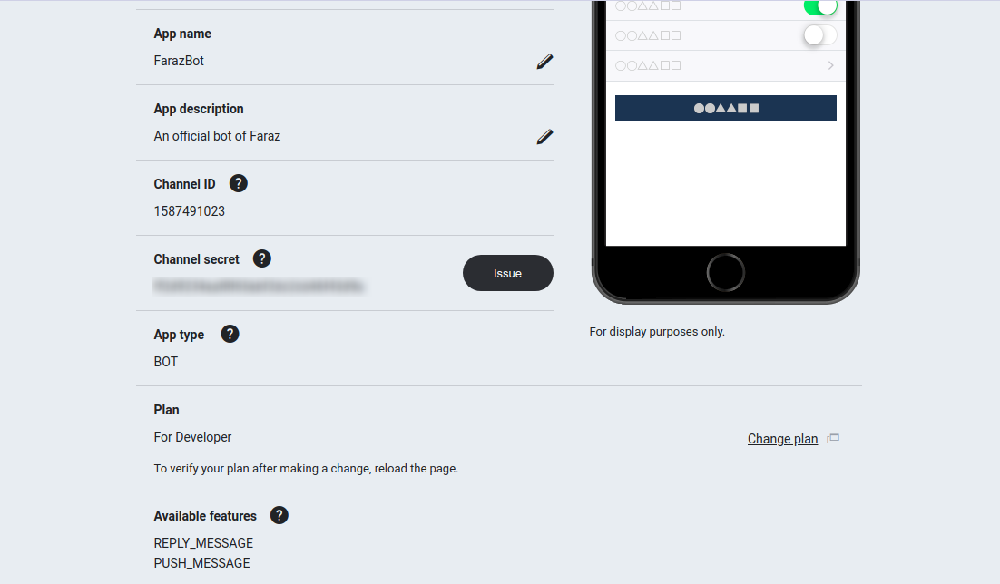
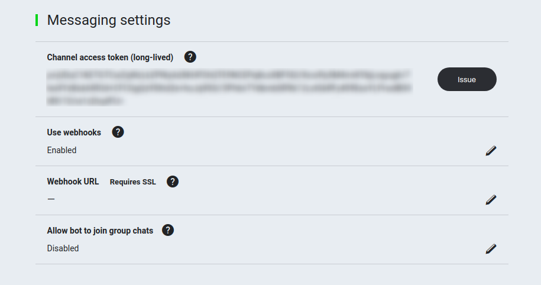
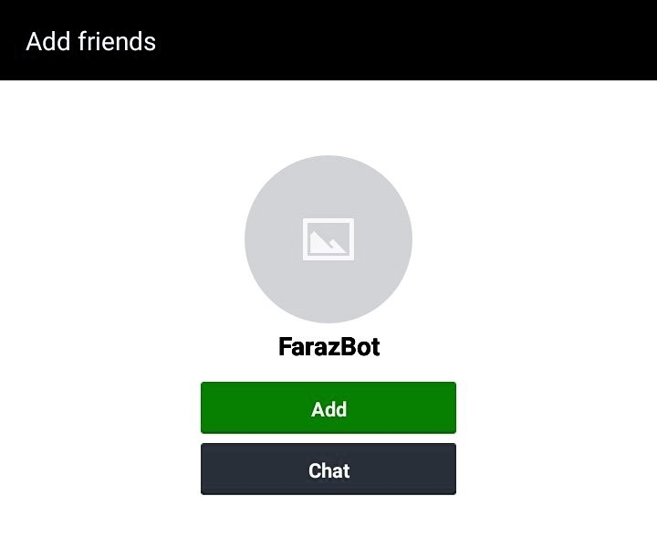
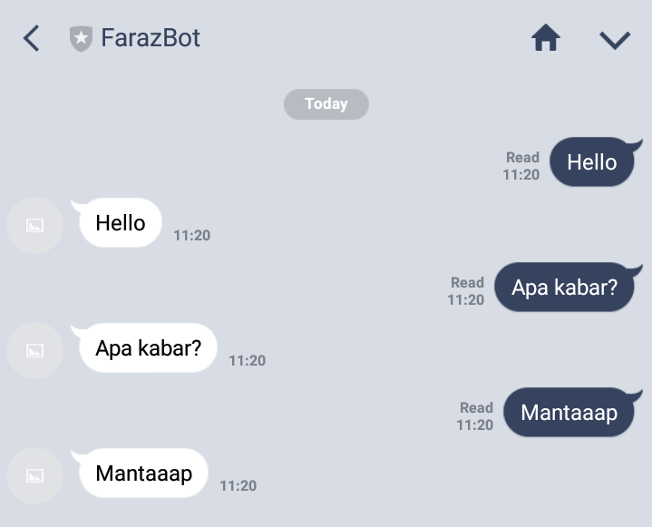

## Tutorial lengkap memanfaatkan LINE Messaging API dan Python Flask untuk membuat chatbot

](./asset-1.png)

### Apa itu LINE Messaging API?

[LINE Messaging API](https://developers.line.me/en/docs/messaging-api/overview/) adalah layanan yang disediakan oleh LINE untuk melakukan pertukaran data antara bot server  dengan LINE Platform. Pertukaran data dilakukan dengan cara mengirim request  melalui HTTPS_._ Jadi, misal kita memiliki sebuah bot server, dengan menggunakan LINE Messaging API itu kita dapat membuat bot server kita berinteraksi dengan aplikasi LINE Messenger yang biasa kita gunakan.

LINE Messaging API ini juga memberikan kita beberapa fitur yang dapat digunakan seperti **Send Reply Messages**, **Send Push Messages**, **Get User Profiles** dan masih banyak lagi. Untuk lebih lengkapnya silahkan mengunjungi halaman resminya

[**Messaging API**  
_The Messaging API allows for data to be passed between the server of your bot application and the LINE Platform. When a…_developers.line.me](https://developers.line.me/en/docs/messaging-api/overview/ "https://developers.line.me/en/docs/messaging-api/overview/")[](https://developers.line.me/en/docs/messaging-api/overview/)

**Apa alesan pake LINE?** Karena, LINE adalah salah satu platform chatting terbesar di Asia Tenggara dan merupakan salah satu aplikasi GRATIS untuk didownload. Jadi, jika Anda ingin mengembangkan produk dan bot di Asia Tenggara, LINE merupakan pilihan yang harus dipertimbangkan.  
NB: Ini bukan endorse yaa hehe :)

Oke, sebelum kita mulai ada beberapa hal yang kita butuhkan

1.  LINE account dan LINE app
2.  LINE developer account (sama dengan akun LINE tapi harus kita aktifkan secara manual).
3.  LINE channel (pilih Developer Trial Plan)
4.  A web server & framework yang dapat mengatur route dan menjadi webhook, jadi setiap pesan akan dikirim kesini dari LINE server. Disini saya akan menggunakan Python Flask dan Heroku.

Untuk mendapatkan yang kita butuhkan pada poin 1–3, Anda dapat mengikuti langkah-langkahnya yang ada dihalaman ini [https://developers.line.me/en/docs/messaging-api/getting-started/](https://developers.line.me/en/docs/messaging-api/getting-started/).

Setelah selesai, buka channel yang telah Anda buat dan kita akan diarahkan ke halaman konfigurasi yang berisi channel ID, channel secret, access token, webhook url dan masih banyak lagi.

Tahap pertama pastikan channel secret Anda tidak kosong, jika kosong silahkan tekan tombol “Issue”. Kemudia periksa kolom **Plan**, disana harus tertera “For Developer” dan terdapat REPLY\_MESSAGE & PUSH\_MESSAGE pada kolom **Available features.**



Tahap kedua masih di halaman yang sama, tekan tombol “Issue” yang ada pada kolom **Channel access token** dan atur **Use webhook** menjadi enabled. Kemudia kolom **Webhook URL** kita biarkan kosong aja.



Kita cukupkan dulu untuk pengaturan Channelnya, untuk pengaturan lainnya dapat Anda sesuaikan dengan kebutuhan dan keinginan Anda. Selanjutnya kita akan masuk di bagian server atau backendnya.

#### Setting up Project

Sebelum kita lanjut, kita harus menyiapkan beberapa hal yang harus terinstall di pc kita

1.  Python ≥ 2.7 atau ≥ 3.5 ([https://www.python.org/downloads/](https://www.python.org/downloads/))
2.  Pipenv ([https://github.com/pypa/pipenv](https://github.com/pypa/pipenv))
3.  Git ([https://git-scm.com/](https://git-scm.com/))

Jika semua tools diatas sudah terinstall, kita akan lanjut ke bagian setting envrionment untuk lingkungan koding aplikasi Python kita.

#### Setting Virtual Environment

Oiya, perlu saya ingatkan, disini saya menggunakan sistem operasi Ubuntu. Jadi tutorial ini dapat dijalankan pada sistem operasi Linux maupun OS X.

```
$ mkdir mybot && cd $_
$ pipenv --three #untuk membuat folder menggunakan python versi 3
```

Kemudian kita install dependecies yang dibutuhkan yaitu **flask** sebagai web framework kita, **SDK** dari LINE Messaging API dan **python-decouple** untuk mempermudah kita mengatur environment variable.

Buka terminal dan jalankan perintah-perintah dibawah ini

```
pipenv install flask
pipenv install line-bot-sdk
pipenv install python-decouple
```

Selanjutnya aktifkan virtual environment

```
pipenv shell
```

Buat file `app.py`, `.env` dan `Procfile` di root folder project

```
touch app.py .env Procfile
```

Struktur project akan terlihat seperti ini

```
mybot
└── app.py
└── Pipfile
└── Pipfile.lock
└── Procfile
└── .env
```

Atur **Channel access token** dan **Channel secret sebagai** environment variables dengan menambahkan kode berikut ke dalam file `mybot/.env`

```
LINE_CHANNEL_SECRET="GANTI DENGAN CHANNEL SECRET ANDA"
LINE_CHANNEL_ACCESS_TOKEN="GANTI DENGAN CHANNEL ACCESS TOKEN ANDA"
```

Kemudian masukkan kode berikut ke dalam file `mybot/app.py`

```
# mybot/app.py

import os
from decouple import config
from flask import (
    Flask, request, abort
)
from linebot import (
    LineBotApi, WebhookHandler
)
from linebot.exceptions import InvalidSignatureError
from linebot.models import (
    MessageEvent, TextMessage, TextSendMessage,
)
app = Flask(__name__)
# get LINE_CHANNEL_ACCESS_TOKEN from your environment variable
line_bot_api = LineBotApi(
    config("LINE_CHANNEL_ACCESS_TOKEN",
           default=os.environ.get('LINE_ACCESS_TOKEN'))
)
# get LINE_CHANNEL_SECRET from your environment variable
handler = WebhookHandler(
    config("LINE_CHANNEL_SECRET",
           default=os.environ.get('LINE_CHANNEL_SECRET'))
)


@app.route("/callback", methods=['POST'])
def callback():
    signature = request.headers['X-Line-Signature']


    # get request body as text
    body = request.get_data(as_text=True)
    app.logger.info("Request body: " + body)


    # handle webhook body
    try:
        handler.handle(body, signature)
    except InvalidSignatureError:
        abort(400)


    return 'OK'


@handler.add(MessageEvent, message=TextMessage)
def handle_text_message(event):
    line_bot_api.reply_message(
        event.reply_token,
        TextSendMessage(text=event.message.text)
    )


if __name__ == "__main__":
    port = int(os.environ.get('PORT', 5000))
    app.run(host='0.0.0.0', port=port)
```

Setelah semua kode di simpan, waktunya kita deploy bot kita ke heroku biar bisa langsung kita coba. Sebelumnya, tambahkan kode berikut ke dalam file `Procfile` yang sudah kita buat sebelumnya.

```
web: python app.py
```

#### Deploying to Heroku

Step 1 — Download dan install [Heroku CLI](https://devcenter.heroku.com/articles/heroku-cli)

Step 2 — Log in ke Heroku dari command line

```
heroku login
```

Step 3 — Buat app di heroku

```
heroku create {HEROKU_APP_NAME}
```

Step 4 — Tambahkan Heroku app tadi ke git remote

```
git init
heroku git:remote -a {HEROKU_APP_NAME}
```

Step 5 — Push ke Heroku

```
git add --all
git commit -m "Commit pertama"
git push heroku master
```

Step 6 — Tambahkan url app heroku ke dalam kolom Webhook URL bot yang sebelumnya telah dibuat di LINE [console](https://developers.line.me/console/).

```
https://{HEROKU_APP_NAME}.herokuapp.com/callback
```

Step 7 — Lihat log heroku

```
heroku logs --tail
```

Setelah server running, maka kita dapat langsung mencobanya

#### Demo

Pertama kita harus menambahkan bot sebagai teman dengan cara scan QR Code yang ada di halaman console kemudian klik **add.**



Setelah ditambahkan, kirim pesan apa saja



Yak, selamat Anda telah berhasil membuat bot pertama Anda. Untuk referensi lebih lengkapnya dapat mengunjungi halaman resminya disini:

[**API reference**  
_Full documentation from LINE Messaging API_developers.line.me](https://developers.line.me/en/docs/messaging-api/reference/ "https://developers.line.me/en/docs/messaging-api/reference/")[](https://developers.line.me/en/docs/messaging-api/reference/)
